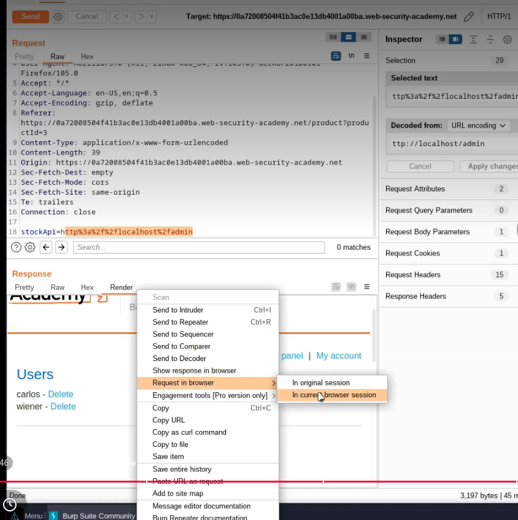
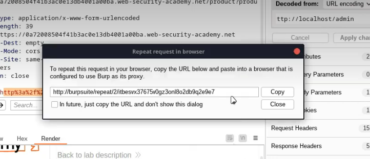

NOTE: Burp Suite includes a built-in browser (Chromium) that is pre-configured to trust Burp’s CA certificate and route traffic through the proxy.

This allows HTTPS interception without manual certificate installation.

When using external browsers like Firefox, the Burp CA certificate must be installed manually for proper HTTPS interception.

Lab: Basic SSRF against another back-end system (Full Walkthrough Notes)

## Step 1 — Capture request using Proxy HTTP History

- I configured my browser to use Burp Suite (`127.0.0.1:8080`)
    
- I left **Intercept OFF**
    
- I navigated to a product and clicked **Check stock**
    
- I went to **Proxy → HTTP history**
    
- I looked for a request with:
    
    - **Status: 200**
        
    - Containing parameter: `stockApi`
        

###  Key point

Even with Intercept OFF, Burp still logs traffic in HTTP history because it is acting as a proxy in the background.

---

##  Step 2 — Send request to Intruder

- I right-clicked the request from "Proxy - HTTP history" → **Send to Intruder**
    
- I modified the `stockApi` parameter to target internal IPs:
    

stockApi=http://192.168.0.1:8080/admin

---

##  Step 3 — Configure payload for internal scanning

- I highlighted the last octet (`1`) in the IP
    
- Clicked **Add §**
    
- Result:
    

stockApi=http://192.168.0.§1§:8080/admin

- Payload settings:
    
    - Type: **Numbers**
        
    - From: `1`
        
    - To: `255`
        
    - Step: `1`
        

---

##  Step 4 — Run Intruder attack

- I started the attack
    
- Initially saw:
    
    - **400** → invalid request
        
    - **500** → server attempted connection
        
- I needed to be patient and let the scan continue not make the assumption that the first numbers populated were the end result.

---

##  Step 5 — Identify interesting response

- I eventually saw a different response:
    

192.168.0.114 → 404

###  Interpretation

404 = host exists, but endpoint not found

 This means:

✔ Internal host is real  
✔ Worth investigating further

---

##  Step 6 — Send to Repeater

- I sent the 404 request to **Repeater**
    
- Clicked **Send**
    

Result:

404 Not Found

---

##  Step 7 — Target admin panel

I modified the request:

stockApi=http://192.168.0.114:8080/admin

- Clicked **Send**
    

---

##  Result

- Received a large response
    
- Found admin interface
    
- Saw sensitive functionality including:
    

/admin/delete?username=carlos

---

##  Step 8 — Perform the exploit

I updated the request:

stockApi=http://192.168.0.114:8080/admin/delete?username=carlos

- Clicked **Send**
    

---

##  Response observed

HTTP/2 302 Found  
Location: http://192.168.0.114:8080/admin

---

##  What that means

302 = redirect

 The server is saying:

“Action completed, go back to /admin”

---

##  Step 9 — Verify the result

- I removed the delete portion and sent:
    

stockApi=http://192.168.0.114:8080/admin

- Clicked **Send**
    

## Step 10 — View SSRF response in browser

While in **Repeater**:

- Right-click request
    
- Select:
    

Request in browser → In current browser session

---

##  Final result

✔ Carlos is no longer present  
✔ Action was successful  
✔ Lab completed

---

#  Important Concepts Learned

---

##  1. Intercept vs HTTP History

Intercept OFF = traffic not paused  
HTTP history = still logs everything

---

##  2. SSRF = internal network access

User input → server request → internal system

---

##  3. Status codes as signals

400 = bad request  
500 = connection attempt  
404 = host exists (important!)  
200 = valid response

---

##  4. SSRF exploitation flow

1. Find input (stockApi)  
2. Confirm SSRF behavior  
3. Scan internal network (Intruder)  
4. Identify host (404/200 difference)  
5. Access internal service (/admin)  
6. Perform action (/delete)

---

##  5. Why browser access failed

Cannot access 192.168.x.x directly from browser

Because:

Browser = external  
Server = internal

 SSRF works by going **through the server**, not directly

---

#  Final takeaway 

SSRF is not just about sending requests  
  
It is about:  
✔ Discovering internal systems  
✔ Accessing hidden functionality  
✔ Executing privileged actions

---

